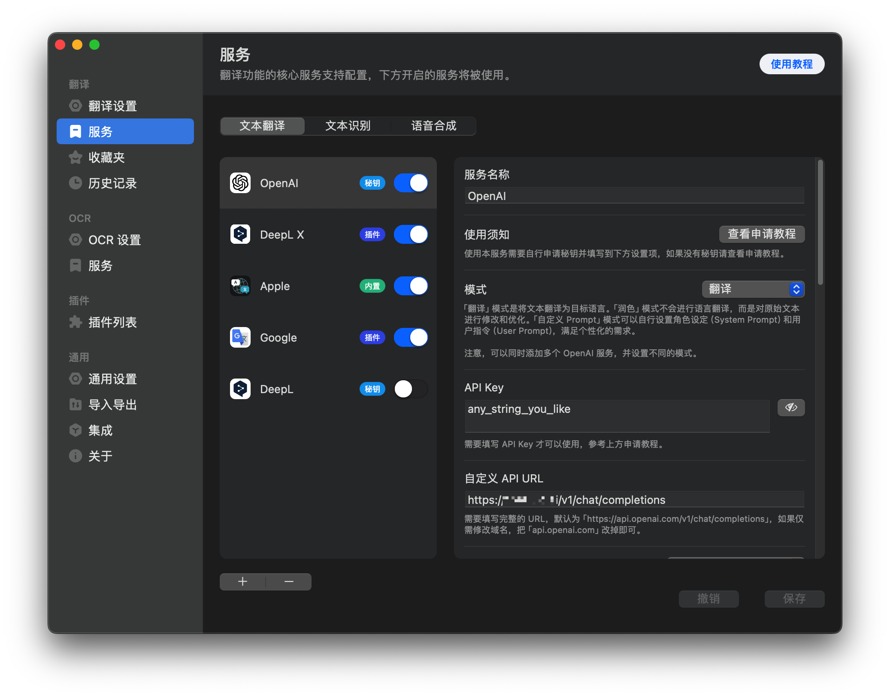

[![Docker Pulls][1]](https://hub.docker.com/r/missuo/freegpt35)

[1]: https://img.shields.io/docker/pulls/missuo/freegpt35?logo=docker

Utilize the unlimited free **GPT-3.5-Turbo** API service provided by the login-free ChatGPT Web.


> [!IMPORTANT]  
> **It seems that OpenAI's risk management has tightened, and this project may no longer be viable.**

## Please READ the following content carefully!
- Please do not use the IP provided by proxy providers, otherwise you probably won't be able to use it. 请不要使用机场的 IP，不然你大概率无法使用。
- Do not make frequent requests, such as using **immersive translate**. 不要频繁请求，例如使用沉浸式翻译。
- Recommended to use US home broadband IP, you are very likely to succeed. 推荐使用美国家宽IP，你很大可能可以成功。
- Don't share and abuse your API. 不要共享和滥用你的 API。

## Deploy
### Node

```bash
npm install
node app.js
```
### Docker

```bash
docker run -p 3040:3040 ghcr.io/missuo/freegpt35
```

```bash
docker run -p 3040:3040 missuo/freegpt35
```

### Docker Compose

#### Only FreeGPT35 Service

```bash
mkdir freegpt35 && cd freegpt35
wget -O compose.yaml https://raw.githubusercontent.com/missuo/FreeGPT35/main/compose.yaml
docker compose up -d
```

#### FreeGPT35 Service with [ChatGPT-Next-Web](https://github.com/ChatGPTNextWeb/ChatGPT-Next-Web):

```bash
mkdir freegpt35 && cd freegpt35
wget -O compose.yaml https://raw.githubusercontent.com/missuo/FreeGPT35/main/compose_with_next_chat.yaml
docker compose up -d
```

After deployment, you can directly access `http://[IP]:3040/v1/chat/completions` to use the API. Or use `http://[IP]:3000` to directly use **ChatGPT-Next-Web**.

#### FreeGPT35 Service with [lobe-chat](https://github.com/lobehub/lobe-chat):

```bash
mkdir freegpt35 && cd freegpt35
wget -O compose.yaml https://raw.githubusercontent.com/missuo/FreeGPT35/main/compose_with_lobe_chat.yaml
docker compose up -d
```

After deployment, you can directly access `http://[IP]:3040/v1/chat/completions` to use the API. Or use `http://[IP]:3210` to directly use **lobe-chat**.

### Nginx Reverse Proxy

```nginx
location ^~ / {
        proxy_pass http://127.0.0.1:3040; 
        proxy_set_header Host $host; 
        proxy_set_header X-Real-IP $remote_addr; 
        proxy_set_header X-Forwarded-For $proxy_add_x_forwarded_for; 
        proxy_set_header REMOTE-HOST $remote_addr; 
        proxy_set_header Upgrade $http_upgrade; 
        proxy_set_header Connection "upgrade"; 
        proxy_http_version 1.1; 
        add_header Cache-Control no-cache; 
        proxy_cache off;
        proxy_buffering off;
        chunked_transfer_encoding on;
        tcp_nopush on;
        tcp_nodelay on;
        keepalive_timeout 300;
    }
```

### Nginx Reverse Proxy with Load Balancer

```nginx
upstream freegpt35 {
        server 1.1.1.1:3040;
        server 2.2.2.2:3040;
}

location ^~ / {
        proxy_pass http://freegpt35; 
        proxy_set_header Host $host; 
        proxy_set_header X-Real-IP $remote_addr; 
        proxy_set_header X-Forwarded-For $proxy_add_x_forwarded_for; 
        proxy_set_header REMOTE-HOST $remote_addr; 
        proxy_set_header Upgrade $http_upgrade; 
        proxy_set_header Connection "upgrade"; 
        proxy_http_version 1.1; 
        add_header Cache-Control no-cache; 
        proxy_cache off;
        proxy_buffering off;
        chunked_transfer_encoding on;
        tcp_nopush on;
        tcp_nodelay on;
        keepalive_timeout 300;
    }
```

## Request Example

**You don't have to pass Authorization, of course, you can also pass any string randomly.**

```bash
curl http://127.0.0.1:3040/v1/chat/completions \
  -H "Content-Type: application/json" \
  -H "Authorization: Bearer any_string_you_like" \
  -d '{
    "model": "gpt-3.5-turbo",
    "messages": [
      {
        "role": "user",
        "content": "Hello!"
      }
    ],
    "stream": true
    }'
```

## Compatibility

You can use it in any app, such as OpenCat, Next-Chat, Lobe-Chat, Bob, etc. Feel free to fill in an **API Key** with any string, for example, `gptyyds`.

### Bob


## Credits
- Forked From: [https://github.com/skzhengkai/free-chatgpt-api](https://github.com/skzhengkai/free-chatgpt-api)
- Original Author: [https://github.com/PawanOsman/ChatGPT](https://github.com/PawanOsman/ChatGPT)

## License
AGPL 3.0 License
